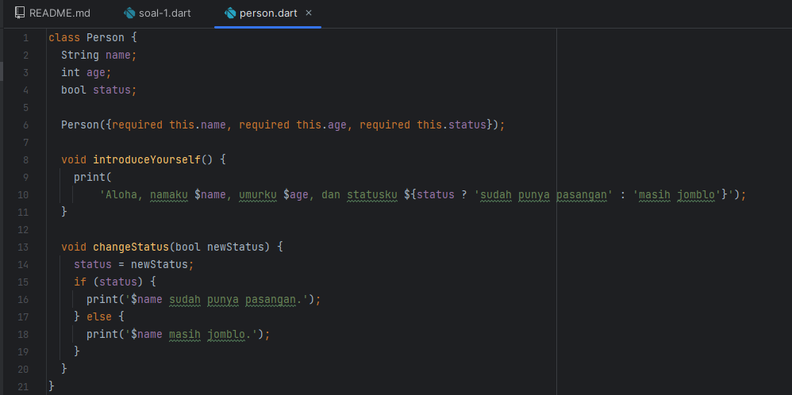

# Week 02 - Dart Variables

Week 02 merupakan week kedua dari pertemuan kuliah mobile development, di pertemuan kedua ini kita
melakukan _breakdown_ terhadap variables yang ada di dalam bahasa pemrograman Dart.

## Task's

### Nomor 1

Melakukan modifikasi sesuai dengan kode yang diminta, yaitu perulangan dan variable

#### Source Code

##### Person Object (_Just for fun_)



##### Main


#### Output


### Nomor 2

Well, kenapa belajar Dart itu penting sebelum memasuki Flutter? Meskipun bahasa pemrograman Dart
bisa dibilang `mirip` dengan bahasa yang lain seperti Java, Python, ataupun bahasa lainnya, tetap
perlu diingat terdapat beberapa perbedaan yang memiliki pengaruh saat melakukan pengembangan
aplikasi _mobile_ nantinya. Bahasa **Dart** tentu memiliki kekhususan syntax yang tidak dimiliki
oleh bahasa lain. Apabila kita tidak memahami syntax Dart, kita akan mengalami kebingungan nantinya
saat melakukan pengembangan aplikasi _mobile_. Menurut penulis di referensi JTI Codelab, Bahasa Dart
merupakan _core_ dari _**framework Flutter**_. That's why mempelajari Dart **is a must.**

### Nomor 3


#### Kenalan yuk sama Dart!

**Dart** merupakan sebuah bahasa pemrograman yang bersifat _open-source_ berorientasi objek yang
dikembangkan oleh Google. Pada awalnya Dart ingin menggantikan bahasa pemrograman _JavaScript_,
namun karena tidak mampu menyaingi JS, pada akhirnya Dart jauh lebih banyak dimanfaatkan untuk
pengembangan aplikasi mobile.

#### Apa sih kelebihan dart?

1. **Productive tooling**:  Fitur untuk menganalisis code, plugin IDE, dan ekosistem _library_ yang
   sangat besar.
2. **Garbage collection**: Fitur yang digunakan untuk pengelolaan dealokasi memori, bertujuan supaya
   kode kita saat dirun bisa lebih efektif.
3. **Type annotations**: Untuk _type safety_ & konsistensi semua data dalam aplikasi kita.
4. **Portability**: Bahasa Dart tidak hanya untuk web tetapi juga dapat dikompilasi secara native ke
   kode Advanced RISC Machines (ARM) dan x86.

Referensi : [Codelab Fluuter JTI Polinema](https://jti-polinema.github.io/flutter-codelab/06-pengantar-bahasa-pemrograman-dart-bag-1/#1)

#### Bagaimana cara kerja Dart?

Dart memiliki fleksibelitas, cara kerjanya adalah sebagai berikut


**Dart VM and JavaScript compilation**

1. Runtime systems
2. Dart core libraries
3. Garbage collectors

Eksekusi code Dart bisa dilakukan di dua mode yang berbeda, yaitu **Just-In-Time (JIT)** atau *
*Ahead-Of-Time (AOT)**.

#### Operator Dasar Dart

Operator dasar dalam bahasa pemrograman Dart memiliki kemiripan dengan operator dasar
dalam bahasa pemrograman lainnya. Berikut adalah beberapa operator dasar yang umum digunakan dalam
Dart:

1. **Operator Aritmatika:**
    - `+` (Penambahan)
    - `-` (Pengurangan)
    - `*` (Perkalian)
    - `/` (Pembagian)
    - `%` (Modulus)

Ex:

```dart
void main() {
   int a = 10;
   int b = 5;

   int tambah = a + b; // Hasilnya adalah 15
   int kurang = a - b; // Hasilnya adalah 5
   int kali = a * b; // Hasilnya adalah 50
   double bagi = a / b; // Hasilnya adalah 2.0
   int modulus = a % b; // Hasilnya adalah 0
}
```

2. **Operator Perbandingan:**
    - `==` (Sama dengan)
    - `!=` (Tidak sama dengan)
    - `<` (Kurang dari)
    - `>` (Lebih dari)
    - `<=` (Kurang dari atau sama dengan)
    - `>=` (Lebih dari atau sama dengan)

Ex:

```dart
void main() {
   int x = 5;
   int y = 10;

   bool samaDengan = x == y; // Hasilnya adalah false
   bool tidakSamaDengan = x != y; // Hasilnya adalah true
   bool kurangDari = x < y; // Hasilnya adalah true
   bool lebihDari = x > y; // Hasilnya adalah false
   bool kurangAtauSamaDengan = x <= y; // Hasilnya adalah true
   bool lebihAtauSamaDengan = x >= y; // Hasilnya adalah false
}
```

3. **Operator Logika:**
    - `&&` (Logika AND)
    - `||` (Logika OR)
    - `!` (Logika NOT)

Ex:

```dart
void main() {
   bool benar = true;
   bool salah = false;

   bool hasilAnd = benar && salah; // Hasilnya adalah false
   bool hasilOr = benar || salah; // Hasilnya adalah true
   bool hasilNot = !benar; // Hasilnya adalah false
}
```

4. **Operator Penugasan:**
    - `=` (Penugasan)
    - `+=` (Penugasan dengan Penambahan)
    - `-=` (Penugasan dengan Pengurangan)
    - `*=` (Penugasan dengan Perkalian)
    - `/=` (Penugasan dengan Pembagian)

Contoh:

```dart

void main() {
   double angka = 10;

   angka += 5; // angka sekarang adalah 15 (angka = angka + 5)
   angka -= 3; // angka sekarang adalah 12 (angka = angka - 3)
   angka *= 2; // angka sekarang adalah 24 (angka = angka * 2)
   angka /= 4; // angka sekarang adalah 6.0 (angka = angka / 4)
}
```

### Nomor 4

Lihat ke sini [Nomor 4](TASKS-4.md) untuk melihat jawaban nomor 4

## Authors

[@alizul01](https://www.github.com/alizul01)