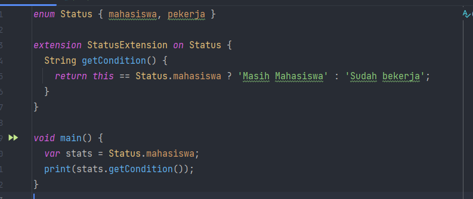
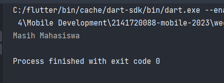
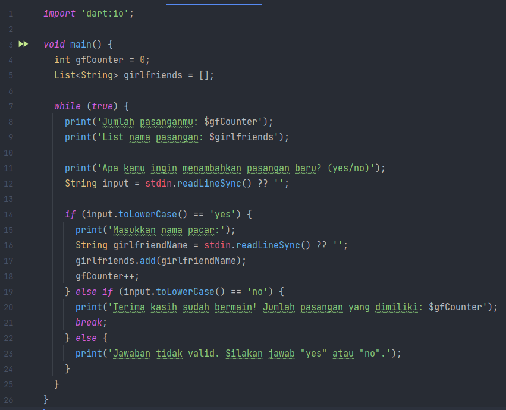
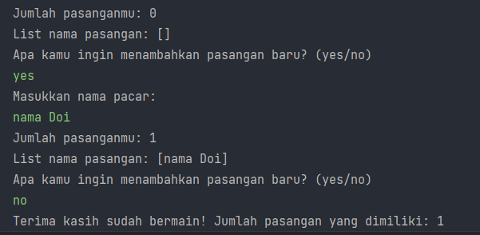
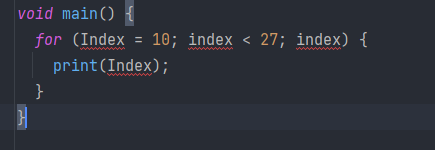
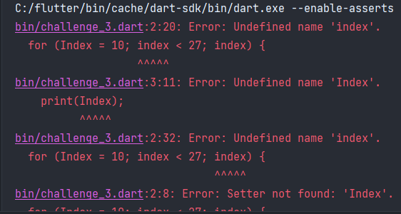
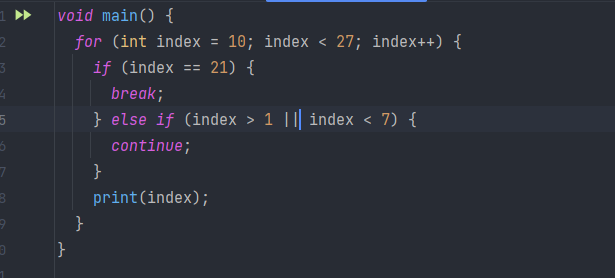
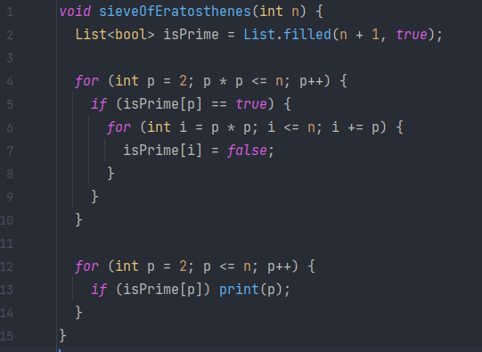
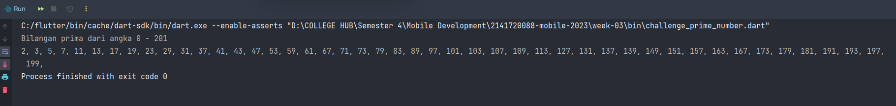

# Week 03 - Condition and Looping

## Task's

### Challenge 1


Sebuah kondisi didapatkan jika status-nya mahasiswa maka akan return nilai String 'masih mahasiswa', namun sebaliknya jika status-nya pekerja akan return nilai String 'sudah bekerja'



### Challenge 2



Sebuah looping tidak akan berhenti jika tidak ada kondisi untuk pemberhentian `break`, didapatkan hasilnya adalah



### Challenge 3


#### 3.1 and 3.2



Akan terjadi error karena perbedaan huruf besar kecil antara `Index` dengan `index`



#### 3.3



Tidak terjadi output karena kesalahan pengecekan kondisi, akan bekerja dengan sesuai harapan jika kondisi diganti menjadi seperti ini

```dart
void main() {
  for (int index = 10; index < 27; index++) {
    if (index == 21) {
      break;
    } else if (index > 1 && index < 7) {
      continue;
    }
    print(index);
  }
}
```

### Prime Challenge

Saya menggunakan referensi algoritma [Sieve of Eratosthenes](https://en.wikipedia.org/wiki/Sieve_of_Eratosthenes) untuk melakukan perhitungan bilangan prima secara optimal. Algoritma tersebut memiliki kompleksitas $O(n \\log \\log n)$



Output codenya adalah sebagai berikut



Algoritma SoF melakukan pengeleminasian terhadap kelipatan sebuah list angka $ke-n$ terhadap kelipatan angka $i$, nantinya bilangan prima dengan kelipatan angka tersebut akan dieliminasi dan yang tersisa adalah sebuah angka yang bukan kelipatan angka $i$. 

## Authors

[@alizul01](https://www.github.com/alizul01)