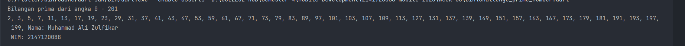

# Week 03 - Condition and Looping

## Task's

### Challenge 1


Sebuah kondisi didapatkan jika status-nya mahasiswa maka akan return nilai String 'masih mahasiswa', namun sebaliknya jika status-nya pekerja akan return nilai String 'sudah bekerja'


### Challenge 2


Sebuah looping tidak akan berhenti jika tidak ada kondisi untuk pemberhentian `break`, didapatkan hasilnya adalah


### Challenge 3


#### 3.1 and 3.2


Akan terjadi error karena perbedaan huruf besar kecil antara `Index` dengan `index`


#### 3.3


Tidak terjadi output karena kesalahan pengecekan kondisi, akan bekerja dengan sesuai harapan jika kondisi diganti menjadi seperti ini

```dart
void main() {
  for (int index = 10; index < 27; index++) {
    if (index == 21) {
      break;
    } else if (index > 1 && index < 7) {
      continue;
    }
    print(index);
  }
}
```

Break berfungsi untuk melakukan pemberhentian sebuah looping, use casenya biasa digunakan untuk berhentikan looping saat mencapai kondisi tertentu. Sedangkan continue digunakan untuk skip sebuah index, use case sesuai kode di atas jika index bernilai rentang 1 - 7 maka tidak akan dicetak. Jika index bernilai 21 maka loop diberhentikan

### Prime Challenge

Saya menggunakan referensi algoritma [Sieve of Eratosthenes](https://en.wikipedia.org/wiki/Sieve_of_Eratosthenes) untuk melakukan perhitungan bilangan prima secara optimal. Algoritma tersebut memiliki kompleksitas $O(n \\log \\log n)$


Output codenya adalah sebagai berikut



Algoritma SoF melakukan pengeleminasian terhadap kelipatan sebuah list angka $ke-n$ terhadap kelipatan angka $i$, nantinya bilangan prima dengan kelipatan angka tersebut akan dieliminasi dan yang tersisa adalah sebuah angka yang bukan kelipatan angka $i$. 


### Playground Looping, Object, Conditional, and others!

[Main](bin/week_03.dart)

```dart
import 'package:week_03/people.dart';

void main() {
  var ali = Person(name: 'Ali Zulfikar', age: 20, maritalStatus: MaritalStatus.single);
  var tio = Person(name: 'Tio Irawan', age: 20, maritalStatus: MaritalStatus.married);
  var rezky = Person(name: 'Bagus Rezky', age: 20, maritalStatus: MaritalStatus.single);

  ali.addFriend(tio);
  ali.addFriend(rezky);

  ali.introduceYourself();
  ali.listFriends();

  tio.introduceYourself();
}
```

[People.dart](lib/people.dart)

```dart
class Person {
  String name;
  int age;
  MaritalStatus maritalStatus;
  List<Person> friends = [];

  Person({required this.name, required this.age, required this.maritalStatus});

  void introduceYourself() {
    print(
        'Aloha, namaku $name, umurku $age, dan statusku ${maritalStatus.getStatus()}');
  }

  void addFriend(Person person) {
    friends.add(person);
  }

  void listFriends() {
    print('$name memiliki teman-teman berikut:');
    for (var friend in friends) {
      print(friend.name);
    }
  }
}

enum MaritalStatus { single, married }

extension MaritalStatusExtension on MaritalStatus {
  String getStatus() {
    return this == MaritalStatus.single
        ? 'masih jomblo'
        : 'sudah punya pasangan';
  }
}
```

Penggunaan ternary condition digunakan untuk melakukan pengecekan kondisi `MaritalStatus`, penggunaan looping dan foreach digunakan untuk list pertemanan

## Authors

[@alizul01](https://www.github.com/alizul01)