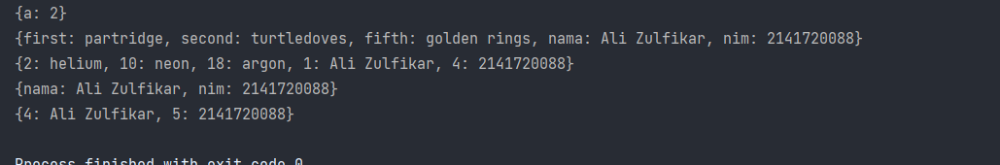
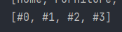
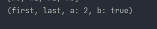

# Week 04 - Condition and Looping

## Task's

### Challenge 1

Untuk list variable sendiri, apabila di awal sudah terdefinisi hanya int maka jika seterusnya apabila ingin diganti di luar inisialisasi akan terjadi error

```dart
List challenge_1() {
  var list = [8, 9, 8, 7, 8, 5, 9, 10];
  assert(list.length == 8);
  assert(list[2] == 8);
  print(list.length);

  list[1] = 'Ali Zulfikar'; // Error
  list[2] = '2141720088'; // Error
  return list;
}
```

Untuk memperbaikinya dapat dibuat demikian
(diganti List)

```dart
List challenge_1() {
  List list = [8, 9, 8, 7, 8, 5, 9, 10];
  assert(list.length == 8);
  assert(list[2] == 8);
  print(list.length);

  list[1] = 'Ali Zulfikar';
  list[2] = '2141720088';
  return list;
}
```

### Challenge 02

Eksperimen data set 

```dart
void challenge_2() {
  var halogens = {'fluorine', 'chlorine', 'bromine', 'iodine', 'astatine'};
  print(halogens);

  var names1 = <String>{};
  Set<String> names2 = {}; // This works, too.
  var names3 = {}; // Creates a map, not a set.
  
  names1.add('Ali Zulfikar');
  names2.add('2141720088');
  names3.addAll({'a' : 2});

  print(names1);
  print(names2);
  print(names3);
}
```

Add digunakan untuk menambah sebuah value ke dalam sebuah list / set karena variable tersebut bersifat dinamis

### Challenge 03

```dart
void challenge_3() {
  var gifts = {'first': 'partridge', 'second': 'turtledoves', 'fifth': 1};

  var nobleGases = {
    2: 'helium',
    10: 'neon',
    18: 2,
  };

  print(gifts);
  print(nobleGases);

  var mhs1 = <String, String>{};
  gifts['first'] = 'partridge';
  gifts['second'] = 'turtledoves';
  gifts['fifth'] = 'golden rings';

  var mhs2 = <int, String>{};
  nobleGases[2] = 'helium';
  nobleGases[10] = 'neon';
  nobleGases[18] = 'argon';
}
```

Untuk penambahan nama dan NIM sesuai dengan challenge yang diberikan, saya menggunakan addAll untuk menambah sebuah value yang memiliki key value pair

```dart
void challenge_3() {
  // ...

  gifts.addAll({'nama': 'Ali Zulfikar', 'nim': '2141720088'});
  nobleGases.addAll({1: 'Ali Zulfikar', 4: '2141720088'});
  mhs1.addAll({'nama': 'Ali Zulfikar', 'nim': '2141720088'});
  mhs2.addAll({4: 'Ali Zulfikar', 5: '2141720088'});

  // ...
}
```



### Challenge 04

Akan terjadi error pada variable list1 karena belum ditambahkan deklarasi `var`

```dart
void challenge_04() {
  var list = [1, 2, 3];
  var list2 = [0, ...list];
  print(list);
  print(list2);
  print(list2.length);

  var list1 = [1, 2, null];
  print(list1);
  var list3 = [0, ...list1];
  print(list3.length);
}
```

Pada langkah selanjutnya menggunakan sebuah pengkondisian di dalam sebuah list, hal tersebut error karena promoActive belum diinisialisasikan

```dart
void challenge_04() {
  bool promoActive = true;
  var nav = ['Home', 'Furniture', 'Plants', if (promoActive) 'Outlet'];
  print(nav);
}
```

Langkah selanjutnya juga demikian, untuk memperbaiki perlu variable `login` terlebih dahulu

```dart
void challenge_04() {
  var login = 'Manager';
  var nav2 = ['Home', 'Furniture', 'Plants', if (login case 'Manager') 'Inventory'];
  print(nav2);
}
```

Terakhir adalah pemanfaatan for di dalam sebuah list, tentu for dalam sebuah list ini untuk mempersingkat kode yang harusnya dalam beberapa baris bisa menjadi 1 baris saja

```dart
void challenge_04() {
  var listOfInts = [1, 2, 3];
  var listOfStrings = ['#0', for (var i in listOfInts) '#$i'];
  assert(listOfStrings[1] == '#1');
  print(listOfStrings);
}
```

Output



### Challenge 05

Pada tahap pertama dilakukan sebuah pembuatan Records
```dart
void challenge_5() {
  var record = ('first', a: 2, b: true, 'last');
  print(record);
}
```

Didapatkan bahwa tidak terjadi error, kode di atas bertujuan untuk membuat sebuah records dengan nama variable `record`

Output



```dart
void challenge_5() {
  (String, int) mahasiswa;
  print(mahasiswa);
}
```

Kode di atas mengalami error karena mahasiswa ingin di-print padahal masih null, untuk memperbaiki perlu dibuat seperti ini

```dart
void challenge_5() {
  (String, int) mahasiswa = ("Ali Zulfikar", 2141720088);
  print(mahasiswa);
}
```

Langkah terakhir yaitu pembuatan sebuah Records dengan nilai yang cukup `unik`

```dart
void challenge_5() {
  var mahasiswa2 = ('first', a: 2, b: true, 'last');

  print(mahasiswa2.$1); // Prints 'first'
  print(mahasiswa2.a); // Prints 2
  print(mahasiswa2.b); // Prints true
  print(mahasiswa2.$2); // Prints 'last'
}
```

`$1` dan `$2` menandakan mengakses sebuah nilai yang bukan `key` seperti a dan b serta uniknya records dimulai dari 1 bukan 0

## Authors

[@alizul01](https://www.github.com/alizul01)