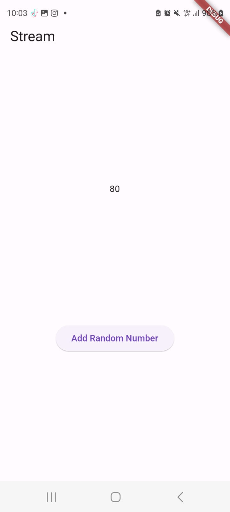
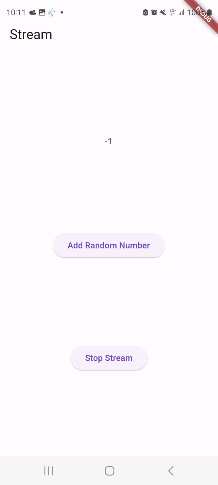

1. `yield*` dalam dart adalah sebuah keyword yang digunakan untuk mengembalikan nilai dari sebuah fungsi generator. 

2. Dalam metode ini, beberapa tindakan dilakukan untuk menginisialisasi dan mengelola aliran data. 
    a. sebuah instansi dari kelas NumberStream dibuat, dan pengontrol aliran yang terkait diperoleh. 
    b. Aliran dihasilkan dari controller ini, dan listener ditetapkan untuk merespons event pada flow dengan update variabel status lastNumber menggunakan metode setState. 
    c. Panggilan super.initState() memastikan bahwa metode initState dari superclass dijalankan.
3. Stream Transformer

    a. Deklarasi Transformer
    ```dart
    StreamTransformer<int, int> transformer =
        StreamTransformer<int, int>.fromHandlers(
    ```
    Membuat sebuah objek StreamTransformer yang akan mentransformasi stream yang menerima nilai bertipe int dan menghasilkan nilai bertipe int.
    
    b. Handler untuk Data:

    ```dart
        handleData: (value, sink) {
            sink.add(value * 10);
        },
    ```

    Ketika data baru diterima di dalam stream, fungsi ini akan dipanggil. Di sini, nilai yang diterima akan dikalikan dengan 10, dan hasilnya akan ditambahkan ke dalam stream yang baru.
    
    c. Handler untuk Error:

    ```dart
        handleError: (error, trace, sink) {
            sink.add(-1);
        },
    ```

    Jika ada kesalahan (error) yang terjadi di dalam stream, fungsi ini akan dipanggil. Dalam kasus ini, nilai -1 akan ditambahkan ke dalam stream.

    d. Handler untuk Selesai (Done):

    ```dart
        handleDone: (sink) => sink.close());
    ```

    Ketika stream telah selesai (done), fungsi ini akan dipanggil. Pada saat itu, sink akan ditutup (closed).



4. Subscription
Fungsi `addRandomNumber` digunakan untuk menambahkan random number ke dalam stream. Dalam kode ini, nantinya akan ada angka acak antara 0 dan 9 dihasilkan, dan kemudian dicek apakah stream masih terbuka. Jika ya, angka tersebut ditambahkan ke dalam stream menggunakan metode addNumber. Namun, jika stream sudah ditutup, nilai lastNumber diubah menjadi -1 menggunakan setState. Ini bertujuan untuk menangani case ketika stream sudah tidak dapat menerima nilai baru.


