# week_05_flutter_basic

A new Flutter project.

## Challenge-01

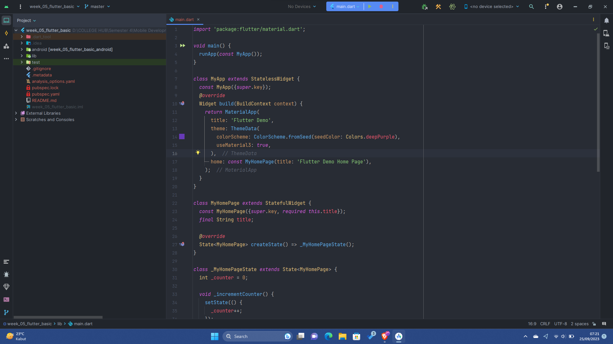

Pembuatan flutter new project, di sini saya hanya memanfaatkan Android saja jadi tidak perlu iOS ataupun OS lainnya

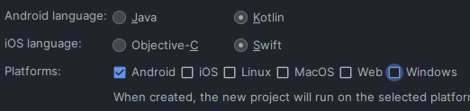

## Challenge-02

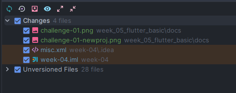

Melakukan push ke GitHub untuk menyimpan folder project

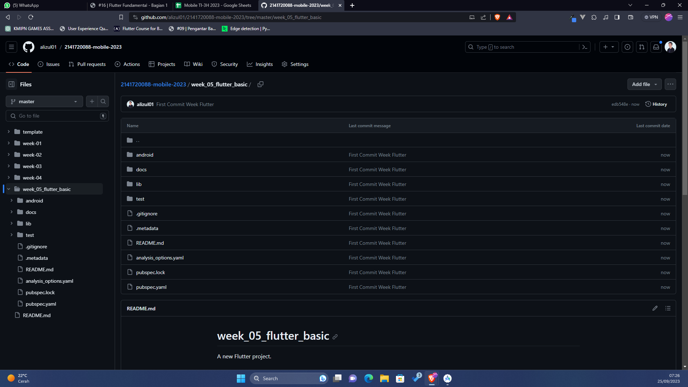

Melakukan start debugging project flutter

## Challenge-03
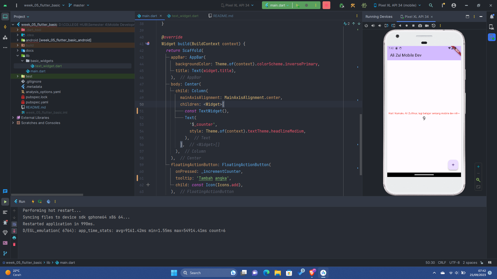
Mengganti text menjadi berwarna merah dan mengganti nama

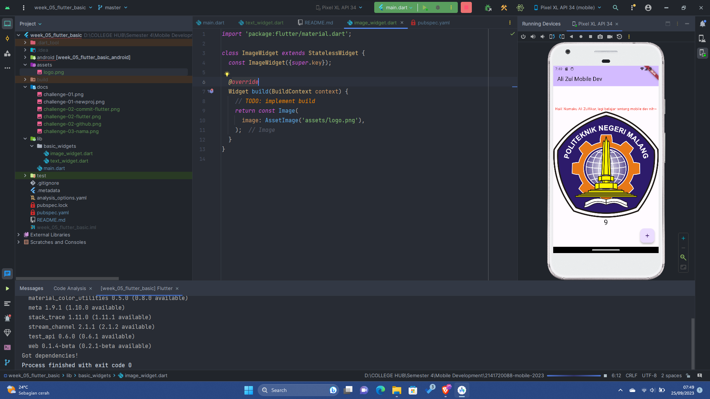
Menambahkan logo Politeknik Negeri Malang ke dalam widget ImageWidget

## Challenge-04

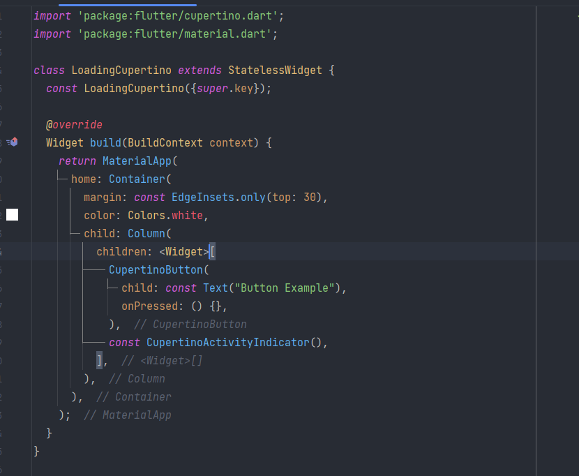

Menambahkan stateless widget loading untuk cupertino theme design

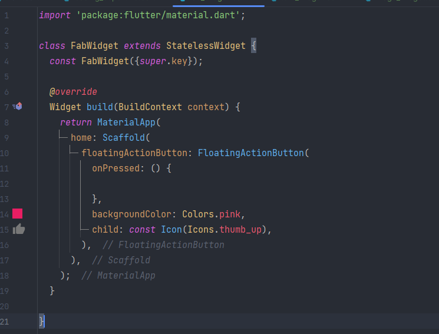

Menambahkan FAB Widget

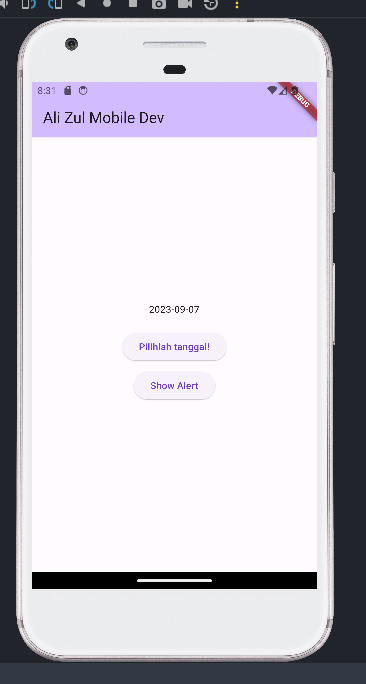
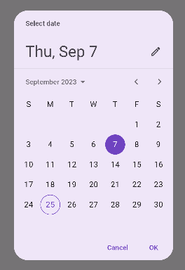

Mengimplementasikan date picker di Flutter

## Challenge

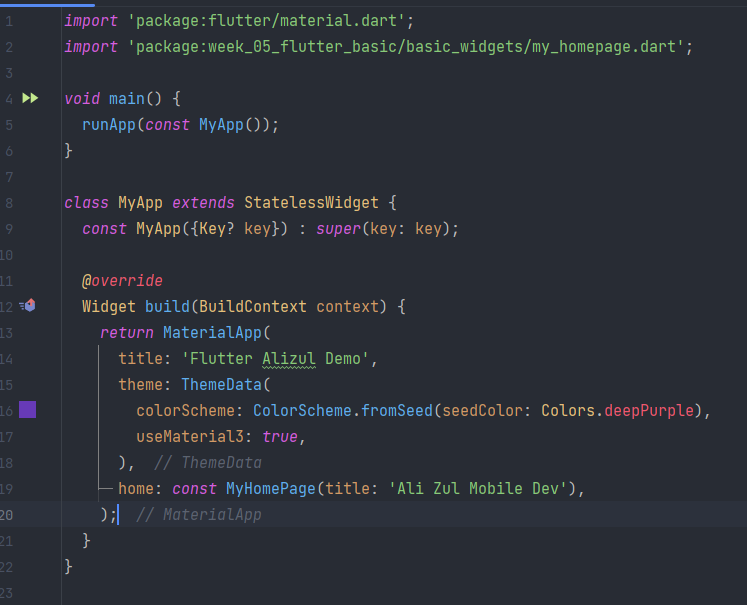
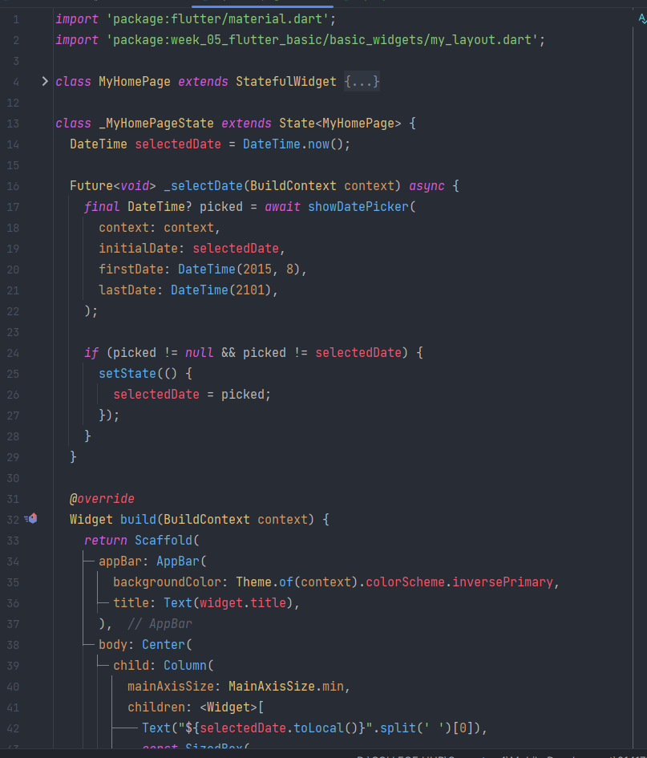

Mengubah menjadi class sendiri - sendiri supaya lebih rapi

