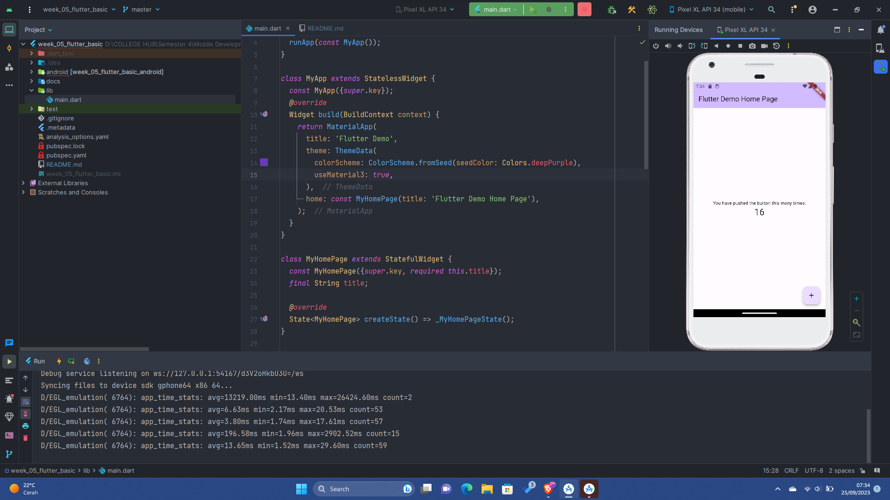

# week_05_flutter_basic

## Challenge-01

Pertama, saya memulai dengan membuat proyek Flutter baru. Saya memutuskan untuk fokus hanya pada
pengembangan untuk platform Android, sehingga tidak perlu mengkonfigurasi atau memperhatikan iOS
atau platform lainnya.

## Challenge-02

Setelah membuat proyek, saya push ke GitHub untuk menyimpan folder proyek. Kemudian, saya mulai
debugging proyek Flutter.

Melakukan start debugging project flutter

## Challenge-03

Saya mengganti teks menjadi berwarna merah dan juga menambahkan logo Politeknik Negeri Malang ke
dalam widget ImageWidget

## Challenge-04

Pada tahap ini, saya menambahkan beberapa elemen. Pertama, saya menambahkan stateless widget untuk
mengikuti desain tema Cupertino. Selanjutnya, saya menambahkan tombol FAB (Floating Action Button)
untuk memberikan fungsi tambahan. Terakhir, saya mengimplementasikan date picker di Flutter, yang
digunakan untuk memilih tanggal.

## Challenge

Nah pada akhirnya, saya menyusun ulang (refactor) kode supaya lebih terstruktur. Saya membuat
kelas-kelas sendiri (SOLID) untuk komponen yang ada dalam proyek, sehingga proyek jadi
lebih terorganisir. Berikut adalah hasil akhir dari proyek Flutter saya:

## Authors

[@alizul01](https://www.github.com/alizul01)