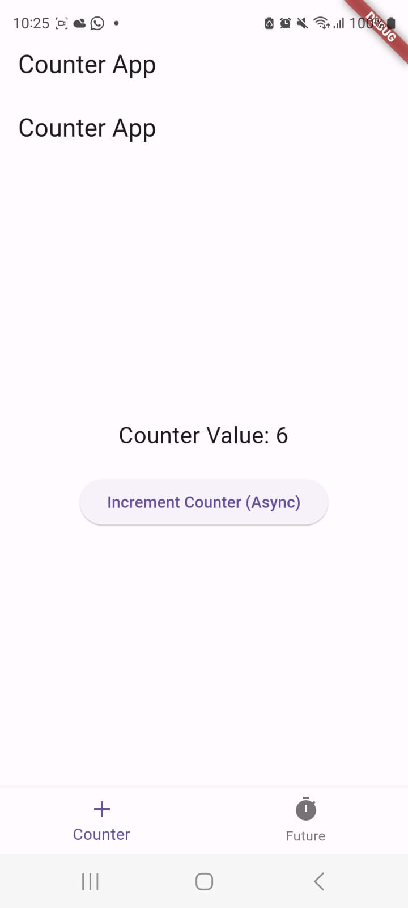

# Week 11 Pemrograman Asinkron

1. **Substring** digunakan untuk memanipulasi string dengan mengambil sebagian darinya, sementara **catchError** digunakan untuk mengatasi kesalahan yang mungkin terjadi selama eksekusi kode, supaya tidak menghentikan eksekusi kode.
   

2. Kode yang diberikan adalah untuk sebuah layar Flutter yang disebut `CounterScreen`. Berikut penjelasan singkat tentang kode tersebut:
   2.1 `CounterScreen` adalah sebuah widget stateful yang menampilkan penghitung dan tombol untuk menambah penghitung secara asinkron.
   2.2 Ini mencakup variabel bilangan bulat `counter` untuk melacak nilai penghitung.
   2.3 Ada variabel boolean `isLoading` yang digunakan sebagai penanda apakah data sedang dimuat. Ini diatur menjadi `false` ketika operasi selesai.

   

3. Kode di atas adalah untuk layar Flutter yang disebut `CompleterScreen` yang mengimplementasikan penggunaan `Completer` untuk operasi asinkron. Berikut adalah penjelasan singkatnya:
   3.1 `CompleterScreen` adalah widget yang digunakan untuk menampilkan contoh penggunaan `Completer` dalam Flutter.
   3.2 Dalam widget ini, terdapat variabel `result` yang digunakan untuk menampilkan hasil operasi asinkron nanti.
   3.3 Saat tombol "Increment Counter (Async)" ditekan, `_incrementCounterAsync()` dipanggil.
   3.4 Di dalam `_incrementCounterAsync()`, kita mengatur `result` menjadi "Loading..." untuk menunjukkan bahwa proses sedang berlangsung.
   3.5 Kemudian, kita memanggil `getNumber()` yang mengembalikan hasil asinkron menggunakan `Completer`.
   3.6 Di dalam `calculate(Completer<int> completer)`, kita menunggu selama 5 detik (simulasi operasi asinkron) dan kemudian menyelesaikan `completer` dengan hasil 42.
   3.7 Setelah `getNumber()` selesai, kita menampilkan hasil dalam `result` jika operasi berhasil atau pesan kesalahan "An error occurred" jika terjadi kesalahan.

   
4. Kode di atas menggunakan `Future.wait`, yang digunakan untuk menjalankan beberapa `Future` secara bersamaan dan menunggu hingga semua `Future` tersebut selesai. Berikut penjelasannya:
   - Kita mendefinisikan sebuah variabel `futures` yang merupakan hasil dari `Future.wait<int>()`.
   - Di dalam `Future.wait`, kita mengirimkan daftar `Future` yang akan dijalankan secara bersamaan. Dalam kasus ini, kita mengirimkan tiga `Future` yaitu `returnOneAsync()`, `returnTwoAsync()`, dan `returnThreeAsync()`.
   - Setelah mengirimkan daftar `Future`, `Future.wait` akan menunggu hingga semua `Future` selesai dieksekusi.
   - Ketika semua `Future` telah selesai, `Future.wait` akan mengembalikan hasil dari masing-masing `Future` dalam bentuk daftar (List) yang sesuai dengan urutan input.
   
   Dengan menggunakan `Future.wait`, kita dapat menjalankan beberapa operasi asinkron secara bersamaan dan menunggu hingga semuanya selesai sebelum melanjutkan eksekusi kode berikutnya.

   
5. `handleError` digunakan untuk mengatasi situasi di mana ada potensi kesalahan atau pengecualian yang dapat terjadi selama eksekusi kode asynchronous. Ini memungkinkan Anda untuk mengendalikan dan mengelola respons saat terjadi kesalahan, sehingga aplikasi Anda tidak akan menghentikan eksekusi sepenuhnya jika ada kesalahan.

6. `GeoLocator` adalah sebuah plugin yang digunakan untuk mendapatkan lokasi pengguna.
7. Dengan menggunakan `Future Builder` jadi lebih rapi dan efisien
8. Navigasi sudah diberikan, dapat terlihat di bagian bawah namun saya modifikasi

9. Menambahkan `dialog` untuk menampilkan pesan
