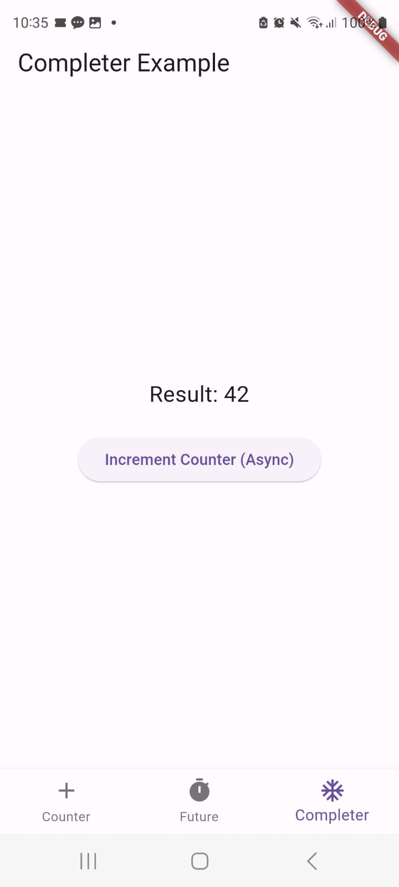

# Week 11 Asynchronous Programming

1. Substring digunakan untuk memanipulasi string dengan mengambil sebagian darinya, sementara catchError digunakan untuk mengatasi kesalahan yang mungkin terjadi selama eksekusi kode, supaya tidak menghentikan eksekusi kode.

2. The provided code is for a Flutter screen called `CounterScreen`. Here's a brief explanation of the code:
2.1 `CounterScreen` is a stateful widget that displays a counter and a button to increment the counter asynchronously.
2.2 It includes an integer variable `counter` to keep track of the counter's value.
2.3 There's a boolean variable `isLoading` used as a flag to indicate whether data is being loaded. It's set to `

3. Kode di atas adalah implementasi penggunaan `Completer` untuk membuat operasi asynchronous di Flutter. Berikut penjelasan singkatnya:
3.1 `CompleterScreen` adalah widget yang digunakan untuk menampilkan contoh penggunaan `Completer` dalam Flutter.
3.2 Dalam widget ini, terdapat sebuah variabel `result` yang digunakan untuk menampilkan hasil operasi asynchronous nanti.
3.3 Saat tombol "Increment Counter (Async)" ditekan, `_incrementCounterAsync()` dipanggil.
3.4 Di dalam `_incrementCounterAsync()`, kita mengatur `result` menjadi "Loading..." untuk menunjukkan bahwa proses sedang berlangsung.
3.5 Kemudian, kita memanggil `getNumber()` yang mengembalikan hasil asynchronous menggunakan `Completer`.
3.6 Di dalam `calculate(Completer<int> completer)`, kita menunggu selama 5 detik (simulasi operasi asynchronous) dan kemudian menyelesaikan `completer` dengan hasil 42.
3.7 Setelah `getNumber()` selesai, kita menampilkan hasil dalam `result` jika operasi berhasil atau pesan kesalahan "An error occurred" jika terjadi kesalahan.

