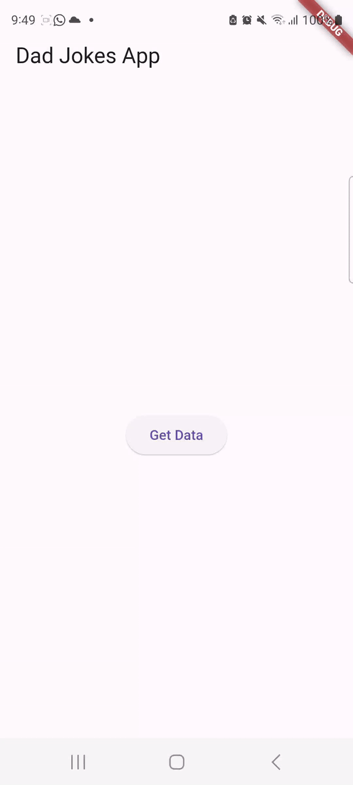

# Week 11 Asynchronous Programming

1. Substring digunakan untuk memanipulasi string dengan mengambil sebagian darinya, sementara catchError digunakan untuk mengatasi kesalahan yang mungkin terjadi selama eksekusi kode, supaya tidak menghentikan eksekusi kode.

2. The provided code is for a Flutter screen called `CounterScreen`. Here's a brief explanation of the code:
2.1 `CounterScreen` is a stateful widget that displays a counter and a button to increment the counter asynchronously.
2.2 It includes an integer variable `counter` to keep track of the counter's value.
2.3 There's a boolean variable `isLoading` used as a flag to indicate whether data is being loaded. It's set to `

